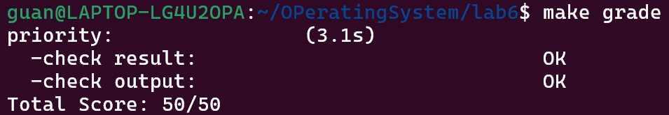

<h1 align="center" style="font-size: 44px"> 实验六：进程调度 </h1>

**小组成员：**

- 管一凡：2312307
- 周雨晴：2312313
- 欧一凡：2312826

**Github仓库地址：**https://github.com/Yifan-Guan/NKU_OS_2025_lab6.git

# 练习1: 理解调度器框架的实现

## sched_class 结构体分析

### 函数指针的作用和调用时机

**1. `init`- 初始化运行队列**

- **作用**：初始化调度器所需的运行队列数据结构
- **调用时机**：系统启动时或调度器初始化时调用一次
- **示例**：初始化运行队列的进程列表、时间片计数器等

**2. `enqueue`- 将进程加入运行队列**

- **作用**：将就绪状态的进程插入到运行队列中
- **调用时机**： 进程从睡眠/阻塞状态变为就绪状态时 时间片用完的进程需要重新加入队列时 必须持有运行队列锁(rq_lock)的情况下调用
- **示例**：将进程插入到队列末尾或根据优先级插入特定位置

**3. `dequeue`- 从运行队列移除进程**

- **作用**：将进程从运行队列中移除
- **调用时机**： 进程进入睡眠/阻塞状态时 进程终止时 必须持有运行队列锁(rq_lock)的情况下调用
- **示例**：从队列中删除指定进程节点

**4. `pick_next`- 选择下一个运行进程**

- **作用**：从运行队列中选择下一个要执行的进程
- **调用时机**： 调度器需要切换进程时（当前进程阻塞或时间片用完） 每次时钟中断后可能调用
- **示例**：返回队列中优先级最高的进程或轮询选择下一个进程

**5. `proc_tick`- 处理时钟滴答**

- **作用**：处理与进程相关的时间片计数和调度决策
- **调用时机**：每次时钟中断发生时调用
- **示例**：递减当前运行进程的时间片，检查是否需要重新调度

### 使用函数指针的原因分析

**1. 支持多种调度策略（核心优势）**

```
// 可以轻松实现不同的调度器
struct sched_class default_sched_class = {
    .name = "default_scheduler",
    .init = default_init,
    .enqueue = default_enqueue,
    // ... 其他函数指针
};

struct sched_class realtime_sched_class = {
    .name = "realtime_scheduler", 
    .init = rt_init,
    .enqueue = rt_enqueue,
    // ... 其他函数指针
};
```

**2. 运行时灵活切换调度器**

- 系统可以根据不同场景（如功耗优化、实时性要求）动态切换调度策略
- 无需重新编译内核即可改变调度行为

**3. 符合面向对象的设计思想**

- 将"是什么调度器"与"如何调度"解耦
- 每个调度器类封装自己的完整调度逻辑

**4. 增强可扩展性和维护性**

- 新增调度策略只需实现新的sched_class实例，无需修改核心调度框架
- 不同调度器的代码相互隔离，降低耦合度

**5. 为SMP（对称多处理）做准备**

- 注释中提到的load_balance等函数指针为未来多核调度留出扩展接口
- 不同CPU可以配置不同的调度策略

### 对比直接实现函数的劣势

如果直接实现函数：

```
// 不灵活的硬编码方式
void schedule(void) {
    if (sched_policy == SCHED_RR) {
        rr_schedule();
    } else if (sched_policy == SCHED_FIFO) {
        fifo_schedule();
    } // 每新增策略都要修改此处
}
```

**问题**：

- 添加新策略需要修改核心调度代码
- 编译时绑定，无法运行时动态切换
- 代码耦合度高，违反开闭原则

## run_queue 两种数据结构分析

### 两种数据结构的作用

**1. `list_entry_t run_list`- 双向链表**

```
struct run_queue {
    list_entry_t run_list;        // 用于普通链表调度
    unsigned int proc_num;
    int max_time_slice;
    skew_heap_entry_t *lab6_run_pool;  // 用于优先队列调度
};
```

**2. `skew_heap_entry_t \*lab6_run_pool`- 斜堆（Skew Heap）**

- 一种自调整的二叉堆结构，支持高效的合并操作

### 支持两种数据结构的原因

**链表适用于**：

- **Round-Robin (RR) 调度**：简单的FIFO或轮询调度
- **公平调度**：所有进程平等对待，不需要优先级排序
- **实现简单**：插入/删除操作O(1)复杂度

**斜堆适用于**：

- **优先级调度**：如Linux的CFS（完全公平调度器）
- **实时调度**：根据优先级快速选择最高优先级进程
- **O(log n)复杂度**：插入、删除、查找最高优先级进程

通过对比两个文档的实现，可以看出从lab5到lab6在调度机制上的重要改进：**将调度策略与调度机制解耦**。让我详细分析这些变化：

## sched_init() 的变化

**lab5**: 没有`sched_init()`函数，调度算法直接硬编码在代码中。

**lab6**: 引入了调度框架初始化：

```
void sched_init(void) {
    list_init(&timer_list);
    sched_class = &default_sched_class;  // 设置调度类
    rq = &__rq;
    rq->max_time_slice = MAX_TIME_SLICE;
    sched_class->init(rq);  // 调用具体调度算法的初始化
}
```

**解耦机制**：

- 通过`sched_class`指针抽象不同的调度算法
- 调度算法以"调度类"的形式实现，包含统一的接口函数指针
- 只需更换`default_sched_class`即可切换不同调度算法

## wakeup_proc() 的变化

**lab5**: 简单设置进程状态：

```
proc->state = PROC_RUNNABLE;
proc->wait_state = 0;
```

**lab6**: 增加了调度器交互：

```
proc->state = PROC_RUNNABLE;
proc->wait_state = 0;
if (proc != current) {
    sched_class_enqueue(proc);  // 将进程加入调度队列
}
```

**解耦机制**：

- 通过`sched_class_enqueue()`函数间接调用具体调度算法的入队操作
- 调度器负责管理就绪队列，`wakeup_proc`只需通知调度器

## schedule() 的变化

**lab5**: 直接遍历进程链表选择下一个进程：

```
// 硬编码的轮询调度
do {
    if ((le = list_next(le)) != &proc_list) {
        next = le2proc(le, list_link);
        if (next->state == PROC_RUNNABLE) {
            break;
        }
    }
} while (le != last);
```

**lab6**: 通过调度类接口选择进程：

```
if (current->state == PROC_RUNNABLE) {
    sched_class_enqueue(current);  // 当前进程重新入队
}
if ((next = sched_class_pick_next()) != NULL) {  // 调度算法选择下一个
    sched_class_dequeue(next);     // 从队列中移除
}
```

基于您提供的代码文档，我将详细分析调度器的初始化流程、进程调度流程以及调度算法切换机制。

## 调度类的初始化流程

### 完整初始化流程：

**内核启动 → 调度器初始化完成：**

```
sched_init() (文档3)
    ↓
list_init(&timer_list)  // 初始化定时器列表
    ↓
sched_class = &default_sched_class  // 设置默认调度类
    ↓
rq = &__rq  // 指向全局运行队列
    ↓
rq->max_time_slice = MAX_TIME_SLICE  // 设置最大时间片(5)
    ↓
sched_class->init(rq)  // 调用RR_init()初始化运行队列
    ↓
cprintf("sched class: %s\n", sched_class->name)  // 输出调度器信息
```

### default_sched_class 与调度器框架的关联：

1. **结构体关联**：`default_sched_class`在default_shed.c中定义，包含RR调度器的函数指针
2. **全局指针**：在shed.c中，`sched_class`全局指针指向 `default_sched_class`
3. **函数转发**：调度器框架函数（如`sched_class_enqueue`）通过`sched_class->enqueue(rq, proc)`调用具体实现
4. **头文件声明**：default_shed.h中通过`extern`声明使得其他文件可以访问调度类

## 2. 进程调度流程

### 完整的进程调度流程图：

```
时钟中断触发
    ↓
中断处理程序
    ↓
sched_class_proc_tick(proc) (文档3)
    ↓
sched_class->proc_tick(rq, proc) → RR_proc_tick() (文档1)
    ↓
检查proc->time_slice是否耗尽
    ↓
如果耗尽：设置proc->need_resched = 1
    ↓
中断返回前检查current->need_resched
    ↓
如果需要调度：调用schedule() (文档3)
    ↓
schedule():
    ├─ 禁用中断
    ├─ current->need_resched = 0
    ├─ 如果current仍可运行：sched_class_enqueue(current)
    ├─ next = sched_class_pick_next() → RR_pick_next()
    ├─ 如果next不为空：sched_class_dequeue(next) → RR_dequeue()
    ├─ 如果next为空：next = idleproc
    ├─ next->runs++
    ├─ 如果next ≠ current：proc_run(next)
    └─ 恢复中断
```

### need_resched 标志位的作用：

1. **调度触发信号**：当时间片耗尽或高优先级进程就绪时设置
2. **延迟调度机制**：在`RR_proc_tick()`中设置，但在中断返回前才实际检查
3. **避免重复调度**：在`schedule()`开始时清零，防止重复调度
4. **idle进程处理**：对idle进程直接设置need_resched=1，保证及时让出CPU

## 3. 调度算法的切换机制

### 添加新调度算法（如stride）需要修改的代码：

1. **实现新的调度类**：

```
struct sched_class stride_sched_class = {
    .name = "stride_scheduler",
    .init = stride_init,
    .enqueue = stride_enqueue,
    .dequeue = stride_dequeue,
    .pick_next = stride_pick_next,
    .proc_tick = stride_proc_tick,
};
```

1. **在头文件中声明**：

```
extern struct sched_class stride_sched_class;
```

1. **切换调度算法**：

```
// 将 sched_class = &default_sched_class; 改为：
sched_class = &stride_sched_class;
```

### 当前设计使得切换容易的原因：

1. **接口抽象**：`struct sched_class`定义了统一的调度接口
2. **策略与机制分离**：调度框架处理通用逻辑，具体算法实现策略
3. **函数指针转发**：通过`sched_class->xxx()`调用，实现多态
4. **最小化修改**：切换算法只需修改`sched_class`指针的赋值
5. **模块化设计**：新调度算法可以独立实现，不影响框架代码

# 练习2: 实现 Round Robin 调度算法

## 函数对比

通过对比lab5和lab6的代码，我们可以清晰地看到 `wakeup_proc`和 `schedule`这两个函数在两个版本中都有实现，但实现方式有显著不同。这些改动的核心原因是 **lab6 引入了调度器框架（Scheduler Framework）**。

下面我们以 `schedule`函数为例，进行详细比较和分析。

### 1. 函数功能对比

**核心功能一致**：在两个版本中，`schedule`函数的核心任务都是完成进程的**调度切换**，即从当前运行的进程（`current`）切换到下一个被选中的进程（`next`）。

### 2. 实现方式对比

| 特性             | lab5 - 简单调度                                              | lab6 - 调度类框架                                            |
| ---------------- | ------------------------------------------------------------ | ------------------------------------------------------------ |
| **调度策略**     | **硬编码（FIFO）**：通过遍历进程链表，找到第一个状态为 `PROC_RUNNABLE`的进程。 | **可插拔**：通过调用 `sched_class->pick_next(rq)`方法。调度策略（如RR、Stride）由具体的 `sched_class`决定。 |
| **运行队列管理** | **隐式管理**：进程链表 `proc_list`充当了运行队列的角色，但进程状态的变化（如从运行态变为就绪态）不会自动更新其在队列中的位置。 | **显式管理**：存在明确的运行队列 `struct run_queue *rq`。调度类提供了 `enqueue`和 `dequeue`方法来精确管理队列中的进程。 |
| **当前进程处理** | **直接丢弃**：如果当前进程仍然是 `PROC_RUNNABLE`，它会被简单地留在进程链表中，等待下次被遍历到。 | **重新入队**：如果当前进程是 `PROC_RUNNABLE`，会调用 `sched_class_enqueue(current)`将其**放回运行队列末尾**，这对于时间片轮转（RR）等公平调度算法至关重要。 |

### 3. 为什么要做这个改动？（不改动会出什么问题？）

这个改动是为了支持**更高级、更公平的调度算法**，特别是**时间片轮转（Round-Robin, RR）算法**。如果不做这个改动，将无法正确实现RR调度，会导致严重问题：

**1. 无法实现公平调度（RR算法的核心缺陷）**

- **lab5 的问题**：在RR算法中，当一个进程用尽它的时间片后，应该被放到运行队列的**末尾**，以保证每个就绪进程都能轮流获得CPU。然而，lab5的调度器只是遍历链表，**当前进程依然保留在链表的原位置**。下次调度时，如果它还是可运行的，并且遍历顺序是从它开始，那么它很有可能**再次被立即选中**，从而形成“饥饿”现象，其他进程得不到执行机会。
- **lab6 的解决**：通过 `sched_class_enqueue(current)`，当前进程被明确地放入运行队列的末尾，确保了调度的公平性。

**2. 调度策略僵化，难以扩展**

- **lab5 的问题**：调度逻辑与FIFO策略强耦合。如果想换成其他算法（如优先级调度、Stride调度），需要直接修改 `schedule`函数的代码，违反了模块化设计原则。
- **lab6 的解决**：引入了调度类（`struct sched_class`），将调度策略（`pick_next`, `enqueue`, `dequeue`, `proc_tick`）抽象为一组接口。只需要更换不同的 `sched_class`实例，就可以轻松切换调度算法，而无需修改核心调度代码。

**3. 运行队列管理不精确**

- **lab5 的问题**：使用整个进程链表 `proc_list`来查找可运行进程，效率较低。而且链表包含了所有状态的进程（如睡眠、僵尸进程），搜索时需要额外判断状态。
- **lab6 的解决**：维护一个专门的运行队列 `rq`，里面只包含就绪态（`PROC_RUNNABLE`）的进程，使得 `pick_next`操作更加高效。

## RR_init - 运行队列初始化

### 具体思路

```
static void RR_init(struct run_queue *rq)
{
    list_init(&rq->run_list);
    rq->proc_num = 0;
}
```

**关键代码解释：**

- `list_init(&rq->run_list)`：初始化运行队列为空的循环双向链表
- `rq->proc_num = 0`：设置队列中进程数量为0

**为什么选择这个方法：**

- 这是标准的链表初始化方式，确保队列从一个干净的状态开始
- 符合内核链表管理的统一接口

**边界情况处理：**

- 空队列初始化：正确设置空链表标志
- 进程计数：从0开始，避免未初始化错误

## RR_enqueue - 进程入队

### 具体思路

```
static void RR_enqueue(struct run_queue *rq, struct proc_struct *proc)
{
    list_add_before(&rq->run_list, &proc->run_link);
    if (proc->time_slice <= 0) {
        proc->time_slice = rq->max_time_slice;
    }
    proc->rq = rq;
    rq->proc_num++;
}
```

**关键代码解释：**

- `list_add_before(&rq->run_list, &proc->run_link)`：**将新进程插入到队列头节点之前**
- `proc->time_slice <= 0`：检查时间片是否耗尽，如果是则重新分配
- `proc->rq = rq`：建立进程与运行队列的关联
- `rq->proc_num++`：增加队列进程计数

**为什么选择 `list_add_before`：**

- 在循环双向链表中，`list_add_before(&head, node)`实际上是将节点**插入到队列尾部**
- 因为头节点 `rq->run_list`是固定的哨兵节点，在其前面添加就是尾部插入
- 这实现了**FIFO（先进先出）** 的RR调度特性

**边界情况处理：**

- **时间片耗尽**：重新分配完整时间片，确保公平性
- **新创建进程**：首次入队时初始化时间片
- **队列关联**：确保进程知道自己在哪个队列中

## RR_dequeue - 进程出队

### 具体思路

```
static void RR_dequeue(struct run_queue *rq, struct proc_struct *proc)
{
    list_del_init(&proc->run_link);
    proc->rq = NULL;
    rq->proc_num--;
}
```

**关键代码解释：**

- `list_del_init(&proc->run_link)`：从链表中删除并重新初始化节点
- `proc->rq = NULL`：清除进程与队列的关联
- `rq->proc_num--`：减少队列进程计数

**为什么选择 `list_del_init`：**

- `list_del_init`不仅删除节点，还将其初始化为独立节点
- 防止悬空指针和重复删除的问题
- 符合内核安全编程规范

**边界情况处理：**

- **进程状态清理**：出队后立即清除队列关联，避免错误引用
- **计数一致性**：确保进程计数与实际情况一致
- **节点安全**：初始化删除的节点，防止后续操作错误

## RR_pick_next - 选择下一个进程

### 具体思路

```
static struct proc_struct *RR_pick_next(struct run_queue *rq)
{
    if (list_empty(&rq->run_list)) {
        return NULL;
    } else {
        list_entry_t *le = rq->run_list.next;
        struct proc_struct *proc = le2proc(le, run_link);
        return proc;
    }
}
```

**关键代码解释：**

- `list_empty(&rq->run_list)`：检查队列是否为空
- `rq->run_list.next`：选择队列中的**第一个进程**
- `le2proc(le, run_link)`：通过链表节点找到对应的进程结构体

**为什么选择队列头部的进程：**

- 这是标准的RR调度策略：选择队列中最先进入的进程
- 实现了公平的轮转调度，每个进程按顺序获得CPU时间

**边界情况处理：**

- **空队列**：返回NULL，由上层调用者处理（通常切换到idle进程）
- **宏转换**：使用 `le2proc`宏安全地进行结构体转换

## RR_proc_tick - 时间片处理

### 具体思路

```
static void RR_proc_tick(struct run_queue *rq, struct proc_struct *proc)
{
    if (proc->time_slice > 0) {
        proc->time_slice--;
    } else {
        proc->need_resched = 1;
    }
}
```

**关键代码解释：**

- `proc->time_slice > 0`：检查是否还有剩余时间片
- `proc->time_slice--`：递减时间片计数
- `proc->need_resched = 1`：时间片耗尽时设置调度标志

**为什么这样处理时间片：**

- 每次时钟中断递减时间片，实现精确的时间控制
- 时间片耗尽时立即标记需要调度，确保及时切换

**边界情况处理：**

- **时间片边界**：当时间片减到0时立即触发调度
- **调度标志**：只在时间片真正耗尽时设置，避免不必要的调度

## make grade 结果



## Round Robin 调度算法分析

### 优点

```
// RR的核心优势体现在代码中：
static void RR_enqueue(struct run_queue *rq, struct proc_struct *proc)
{
    list_add_before(&rq->run_list, &proc->run_link); // 公平的FIFO队列
    if (proc->time_slice <= 0) {
        proc->time_slice = rq->max_time_slice; // 时间片公平分配
    }
}
```

**具体优点：**

1. **公平性**：每个进程获得相等的时间片，避免饥饿现象
2. **响应性好**：交互式进程能够及时获得CPU时间
3. **实现简单**：代码逻辑清晰，如当前实现所示
4. **适合分时系统**：满足多用户环境的时间共享需求

### 缺点

```
// RR的缺点在以下场景中体现：
static void RR_proc_tick(struct run_queue *rq, struct proc_struct *proc)
{
    if (proc->time_slice > 0) {
        proc->time_slice--; // 频繁的上下文切换开销
    }
}
```

**具体缺点：**

1. **上下文切换开销大**：时间片过小时频繁切换
2. **吞吐量较低**：CPU密集型进程完成时间较长
3. **不考虑进程优先级**：所有进程平等对待
4. **缓存性能差**：频繁切换导致缓存失效

## 时间片大小优化策略

### 时间片调整的影响

```
// 时间片大小需要在系统级别调整
struct run_queue {
    int max_time_slice; // 关键参数，影响系统性能
    // ...
};
```

**优化策略矩阵：**

| 时间片大小         | 优点           | 缺点       | 适用场景   |
| ------------------ | -------------- | ---------- | ---------- |
| **过小**(1-10ms)   | 响应性极佳     | 切换开销大 | 交互式系统 |
| **适中**(10-100ms) | 平衡响应和吞吐 | 折中方案   | 通用系统   |
| **过大**(>100ms)   | 吞吐量高       | 响应性差   | 批处理系统 |

**动态调整建议：**

```
// 伪代码：基于系统负载的动态时间片调整
void dynamic_time_slice_adjust(struct run_queue *rq)
{
    if (rq->proc_num > HIGH_LOAD_THRESHOLD) {
        rq->max_time_slice = BASE_SLICE / 2; // 高负载时减小时间片
    } else if (rq->proc_num < LOW_LOAD_THRESHOLD) {
        rq->max_time_slice = BASE_SLICE * 2; // 低负载时增大时间片
    }
}
```

## need_resched 标志的重要性

```
static void RR_proc_tick(struct run_queue *rq, struct proc_struct *proc)
{
    if (proc->time_slice > 0) {
        proc->time_slice--;
    } else {
        proc->need_resched = 1; // 关键标志设置
    }
}
```

**设置 need_resched 的原因：**

1. **异步调度触发**： 时钟中断是异步事件 不能直接在中断上下文中进行进程切换 需要标志位让内核在合适时机进行调度
2. **调度时机的控制**： `// 内核在返回用户空间前检查该标志 void trap_dispatch(struct trapframe *tf) {    // ...    if (current->need_resched) {        schedule(); // 在安全上下文进行调度    } }`
3. **避免优先级反转**： 确保高优先级进程能及时获得CPU 防止时间片耗尽的进程继续占用CPU

## 优先级 RR 调度实现方案

### 当前代码的局限性

```
// 当前实现缺乏优先级支持
struct proc_struct {
    // 缺少优先级字段
    list_entry_t run_link;
    int time_slice;
    // ...
};
```

### 优先级 RR 修改方案

**1. 数据结构扩展：**

```
// 修改进程结构体
struct proc_struct {
    int priority;           // 新增：优先级
    int time_slice;         // 基于优先级的时间片
    list_entry_t run_link;
    // ...
};

// 多优先级队列
struct run_queue {
    list_entry_t run_lists[MAX_PRIORITY]; // 每个优先级一个队列
    int proc_num;
    int max_time_slice[MAX_PRIORITY]; // 不同优先级不同时间片
};
```

**2. 调度算法修改：**

```
// 优先级感知的入队操作
static void PRIO_RR_enqueue(struct run_queue *rq, struct proc_struct *proc)
{
    int prio = proc->priority;
    list_add_before(&rq->run_lists[prio], &proc->run_link);
    
    // 基于优先级的时间片分配
    proc->time_slice = rq->max_time_slice[prio];
    rq->proc_num++;
}

// 优先级调度选择
static struct proc_struct *PRIO_RR_pick_next(struct run_queue *rq)
{
    // 从高优先级到低优先级扫描
    for (int prio = MAX_PRIORITY - 1; prio >= 0; prio--) {
        if (!list_empty(&rq->run_lists[prio])) {
            list_entry_t *le = rq->run_lists[prio].next;
            return le2proc(le, run_link);
        }
    }
    return NULL;
}
```

## 多核调度支持分析

### 当前实现的局限性

```
// 当前是单核调度器设计
struct run_queue {
    // 全局单一运行队列，不支持多核
    list_entry_t run_list; 
    // ...
};
```

### 多核调度改进方案

**1. 每核运行队列：**

```
// 每CPU运行队列
struct run_queue per_cpu_rq[NUM_CPUS];

// CPU关联信息
struct proc_struct {
    int cpu_id; // 进程绑定的CPU
    // ...
};
```

**2. 负载均衡机制：**

```
// 负载均衡伪代码
void load_balance(void)
{
    for (int cpu = 0; cpu < NUM_CPUS; cpu++) {
        if (per_cpu_rq[cpu].proc_num > LOAD_THRESHOLD) {
            // 从过载CPU迁移进程到空闲CPU
            migrate_process(overloaded_cpu, idle_cpu);
        }
    }
}
```

**3. 锁机制改进：**

```
// 多核安全的队列操作
static void RR_enqueue(struct run_queue *rq, struct proc_struct *proc)
{
    spin_lock(&rq->lock); // 新增：队列锁
    list_add_before(&rq->run_list, &proc->run_link);
    rq->proc_num++;
    spin_unlock(&rq->lock);
}
```

# Challenge 1: 实现 Stride Scheduling 调度算法

## 1. Stride算法时间片分配比例证明

**简要证明：**

设进程P₁, P₂, ..., Pₙ的优先级分别为priority₁, priority₂, ..., priorityₙ，BIG_STRIDE为常数。

1. **Stride增长规则**：每次被调度时，进程i的stride增加：passᵢ = BIG_STRIDE / priorityᵢ
2. **调度选择**：总是选择当前stride值最小的进程执行
3. **长期均衡**：经过足够长时间后，各进程的stride值会趋于接近（否则stride值小的进程会一直被调度）
4. **比例关系**：设进程i被调度了Kᵢ次，则其总stride增长为Kᵢ × passᵢ 当系统稳定时，各进程的总stride增长应大致相等： K₁ × pass₁ ≈ K₂ × pass₂ ≈ ... ≈ Kₙ × passₙ
5. **推导比例**：Kᵢ / Kⱼ ≈ passⱼ / passᵢ = priorityᵢ / priorityⱼ

**结论**：被调度次数与优先级成正比，而每次调度时间片相同，因此分配到的时间片总数与优先级成正比。

## 2. 代码设计实现分析

### 数据结构设计

- **运行队列**：使用斜堆(skew heap)实现优先队列，按stride值排序
- **进程控制块**：包含lab6_stride(当前步长)、lab6_priority(优先级)、lab6_run_pool(堆节点)

### 核心函数实现

#### (1) 初始化(stride_init)

- 初始化运行队列为空
- 设置进程数为0

#### (2) 入队(stride_enqueue)

```
rq->lab6_run_pool = skew_heap_insert(rq->lab6_run_pool,
                                    &proc->lab6_run_pool,
                                    proc_stride_comp_f);
```

- 使用斜堆插入操作，时间复杂度O(logN)
- 比较函数按stride值排序

#### (3) 出队(stride_dequeue)

- 从斜堆中移除指定进程

#### (4) 选择下一个(stride_pick_next)

```
p->lab6_stride += BIG_STRIDE / p->lab6_priority;
```

- 选择stride最小的进程（堆顶元素）
- **关键步骤**：更新被选中进程的stride值

#### (5) 时间片处理(stride_proc_tick)

- 递减时间片，为0时设置重新调度标志

# Challenge 2 ：在ucore上实现尽可能多的各种基本调度算法(FIFO, SJF,...)，并设计各种测试用例，能够定量地分析出各种调度算法在各种指标上的差异，说明调度算法的适用范围。

## FIFO（先进先出）调度算法

### 数据结构

- 使用双向链表 `run_list`管理就绪队列
- 按进程加入队列的顺序进行调度

### 核心函数实现

**fifo_init()**

```
static void fifo_init(struct run_queue *rq) {
    list_init(&rq->run_list);  // 初始化空链表
    rq->lab6_run_pool = NULL;  // 不使用堆结构
    rq->proc_num = 0;          // 进程数为0
}
```

**fifo_enqueue()**

```
static void fifo_enqueue(struct run_queue *rq, struct proc_struct *proc) {
    list_add_before(&rq->run_list, &proc->run_link);  // 插入到链表尾部
    if (proc->time_slice <= 0) {
        proc->time_slice = rq->max_time_slice;  // 重置时间片
    }
    proc->rq = rq;    // 设置进程所属运行队列
    rq->proc_num++;   // 增加进程计数
}
```

**fifo_pick_next()**

```
static struct proc_struct *fifo_pick_next(struct run_queue *rq) {
    if (list_empty(&rq->run_list)) return NULL;
    list_entry_t *le = rq->run_list.next;  // 选择链表第一个进程（最早加入）
    return le2proc(le, run_link);
}
```

**fifo_proc_tick()**

```
static void fifo_proc_tick(struct run_queue *rq, struct proc_struct *proc) {
    // 非抢占式调度，时间片用完也不触发重新调度
    (void)rq;
    (void)proc;
}
```

### 特点

- **非抢占式**：进程一旦获得CPU，会一直运行直到完成
- **简单公平**：按到达顺序服务，不会出现饥饿现象
- **时间复杂度**：入队O(1)，出队O(1)，选择下一个O(1)

## SJF（最短作业优先）调度算法

### 数据结构

- 使用**斜堆（skew heap）** 作为优先队列
- 按进程的优先级（`lab6_priority`，代表估计运行时间）排序

### 核心比较函数

```
static int proc_sjf_comp_f(void *a, void *b) {
    struct proc_struct *p = le2proc(a, lab6_run_pool);
    struct proc_struct *q = le2proc(b, lab6_run_pool);
    int32_t diff = (int32_t)p->lab6_priority - (int32_t)q->lab6_priority;
    
    if (diff < 0) return -1;    // p优先级更高（运行时间更短）
    else if (diff > 0) return 1; // q优先级更高
    
    // 优先级相同时，使用PID作为决胜条件
    if (p->pid < q->pid) return -1;
    else if (p->pid > q->pid) return 1;
    return 0;
}
```

### 核心函数实现

**sjf_enqueue()**

```
static void sjf_enqueue(struct run_queue *rq, struct proc_struct *proc) {
    // 使用斜堆插入，自动按优先级排序
    rq->lab6_run_pool = skew_heap_insert(rq->lab6_run_pool, 
                                        &proc->lab6_run_pool, proc_sjf_comp_f);
    if (proc->time_slice <= 0) {
        proc->time_slice = rq->max_time_slice;
    }
    proc->rq = rq;
    rq->proc_num++;
}
```

**sjf_pick_next()**

```
static struct proc_struct *sjf_pick_next(struct run_queue *rq) {
    if (rq->lab6_run_pool == NULL) return NULL;
    // 斜堆的根节点就是优先级最高的进程（估计运行时间最短）
    skew_heap_entry_t *she = rq->lab6_run_pool;
    struct proc_struct *p = le2proc(she, lab6_run_pool);
    return p;
}
```

**sjf_dequeue()**

```
static void sjf_dequeue(struct run_queue *rq, struct proc_struct *proc) {
    // 从斜堆中删除指定节点
    rq->lab6_run_pool = skew_heap_remove(rq->lab6_run_pool, 
                                        &proc->lab6_run_pool, proc_sjf_comp_f);
    proc->rq = NULL;
    rq->proc_num--;
}
```

### 特点

- **非抢占式**：进程运行直到完成
- **最优平均等待时间**：理论上SJF能提供最短的平均等待时间
- **可能饥饿**：长作业可能永远得不到执行
- **时间复杂度**：入队O(log n)，出队O(log n)，选择下一个O(1)

## 关键差异对比

| 特性           | FIFO调度器   | SJF调度器        |
| -------------- | ------------ | ---------------- |
| **数据结构**   | 双向链表     | 斜堆（优先队列） |
| **调度策略**   | 先进先出     | 最短作业优先     |
| **时间复杂度** | O(1)         | O(log n)         |
| **公平性**     | 公平，无饥饿 | 可能饥饿长作业   |
| **实现复杂度** | 简单         | 较复杂           |

